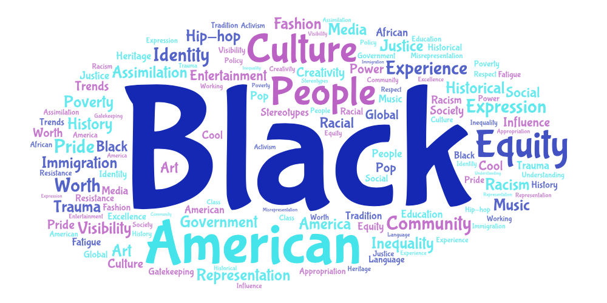
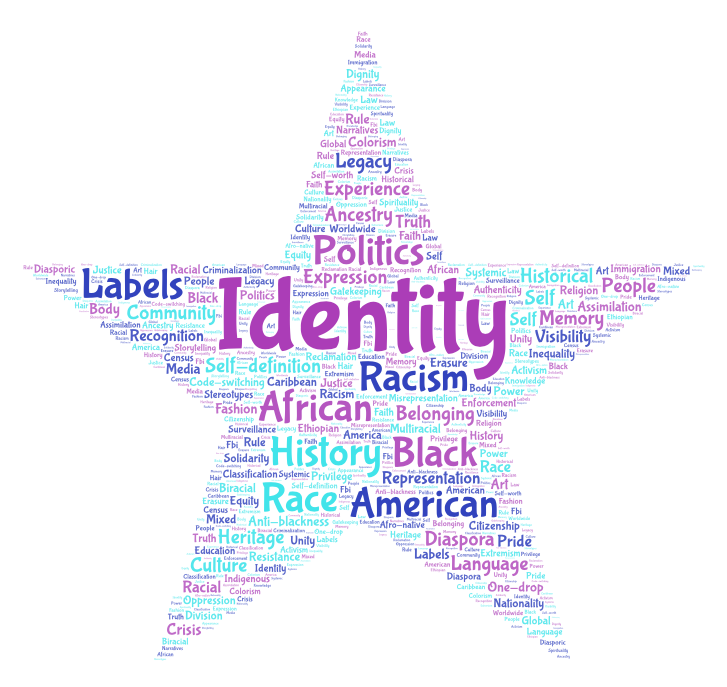
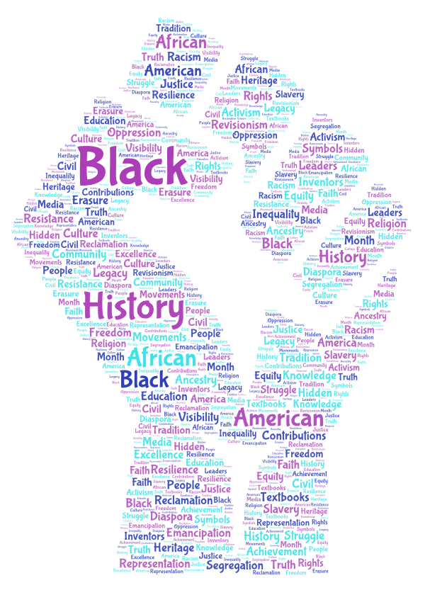

# Lab 02 – Web Data Collection and Visualization

## Topic and Search Parameters
This project explores how Black culture, Black identity, and Black history are represented on YouTube. 
I collected video data using three search terms:
- Black culture
- Black identity
- Black history

For each search term, I used a Selenium-based web crawler to collect video metadata and descriptions from YouTube search results.

## Why This Comparison
I chose to compare these three terms because they represent different but interconnected parts of Black experience. Black culture often focuses on creativity and influence, Black identity deals more with questions of self-definition and belonging, and Black history centers on legacy and memory.

By comparing them side by side, it becomes easier to see how language and framing shift depending on the topic. This comparison helps reveal how the same community can be discussed in very different ways depending on whether the focus is cultural expression, identity formation, or historical narrative.

## Word Cloud Comparison

### Black Culture

The Black culture word cloud emphasizes creativity, expression, and influence. 
Words related to music, media, and popular culture appear frequently, highlighting how Black culture is often framed through entertainment and visibility.

### Black Identity

The Black identity word cloud focuses on self-definition, belonging, and labeling.
Terms related to race, diaspora, and identity politics appear more often, reflecting ongoing debates around who defines Blackness and how identity is constructed.

### Black History

The Black history word cloud highlights themes of erasure, legacy, and resistance.
Words connected to slavery, civil rights, and historical correction appear frequently, showing how Black history is often framed as something that must
be recovered or reclaimed.

## Interpretation of Patterns
Overall, the word clouds show that YouTube frames Black culture as expressive and present-focused, Black identity as complex and contested, and Black
history as something that must be actively recovered. Each search term produces a different kind of language, even though they all relate to the same community.

These patterns suggest that the platform emphasizes different narratives depending on context. Culture is often highlighted through visibility and
creativity, identity through debate and self-definition, and history through correction and education. This likely reflects both how creators label their content and how YouTube’s recommendation system groups videos around popular themes and audiences.

## Limitations and Future Improvements
This project could be improved by collecting a larger number of videos for each search term. Increasing the number of scrolls or expanding the list 
of related search terms could produce more representative results.

Future research could also compare how these topics are discussed across different geographic locations or over time. This would help show 
whether patterns change depending on place or historical moment.

## Unexpected Findings
One thing that stood out to me was how entertainment-heavy the Black culture search was compared to the other two. I expected more overlap between 
culture, identity, and history, but the differences were more distinct than I anticipated.

In contrast, Black history content felt much more serious and corrective, which highlights how differently these topics are framed even when they 
relate to the same community.

## Data Downloads
- [Black Culture CSV](Assets/black_culture.csv)
- [Black Identity CSV](Assets/black_identity.csv)
- [Black History CSV](Assets/black_history.csv)
